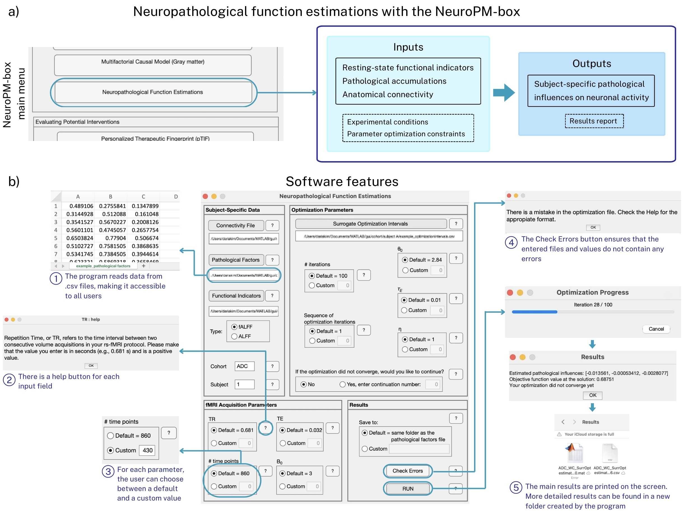

# Neuropathological Function Estimations

## Description

The **Neuropathological Function Estimations** software is designed to assist in studying alterations in neuronal activity in neurological disorders. The tool requires no programming expertise, making it accessible to a wide range of researchers.

The software processes regional inputs such as resting-state functional indicators, pathological accumulations, inter-regional anatomical connectivity, and experimental conditions/parameter optimization constraints. With this data, the tool generates a whole-brain neuropathological influence model and identifies the most likely influence parameters using a surrogate optimization algorithm.

## Workflow

The software operates in several key sections:

1. **Subject-Specific Data**: Users can input biological measurement files for each participant, select the functional indicators used, and tag participants according to their cohort.
2. **fMRI Acquisition Parameters**: Users can specify their imaging protocol, and the software will generate resting-state fMRI signals based on these inputs.
3. **Optimization Parameters**: Users can select optimization methods for calculating the results.
4. **Results**: Users can check for errors using the ‘Check Errors’ button after inputting the data. Pressing the ‘RUN’ button initiates the calculations. Once complete, output files in `.mat` and `.csv` formats will be generated and displayed.

## Requirements

This graphical user interface (GUI) is a standalone application available for **Windows**, **macOS**, and **Linux**. It requires the installation of **MATLAB Runtime** to function. Researchers can upload data in `.csv` format.

## User Guide and Examples

For more detailed instructions, please take a look at the tutorial included with the software package.

## Citation

Panait, A.M., Kim, A., Rodriguez-Rojas, R., Sanchez-Rodriguez, L.M., Iturria-Medina, Y. (2025). *'Neuropathological Function Estimations': A User-Friendly Module for Analyzing Neural Activity in Neurological Disorders*. Bioinformatics Advances. [https://doi.org/10.1093/bioadv/vbaf083](https://doi.org/10.1093/bioadv/vbaf083)

## Authors

- **L.M. Sanchez-Rodriguez**
- **A.M. Panait**
- **A. Kim**
- **R. Rodriguez-Rojas**
- **Y. Iturria-Medina**

## Contact Information

For inquiries or support, feel free to reach out to the authors via email:

- **L.M. Sanchez-Rodriguez**: [lazaro.sanchezrodriguez@mail.mcgill.ca](mailto:lazaro.sanchezrodriguez@mail.mcgill.ca)
